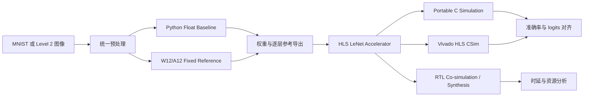

# FPGA LeNet 推理加速器

面向 MNIST 手写数字识别的 LeNet 卷积神经网络 FPGA 推理加速工程。项目以 Python 模型作为软件基准，建立 Float 与 W12/A12 Fixed 两条参考链路，并使用 HLS 完成卷积、池化、全连接、存储组织和控制调度的硬件实现与验证。

本目录是项目的最终集成工程，包含算法模型、定点参考、HLS 源码、测试平台、Level 2 自采数据、优化版本和已有实验结果。

## 项目状态

| 项目 | 当前状态 |
|---|---|
| Level 1 MNIST Float 基准 | 98.97%（9897/10000） |
| Level 1 optimized Fixed HLS C Simulation | 98.94%（9894/10000） |
| optimized RTL latency | 18428 cycles |
| aggressive5b RTL latency | 11025 cycles |
| Level 2 自采数据 | 340 张，每类 34 张 |
| Level 2 Full Fixed/HLS C Simulation | 260/340，76.47% |
| 目标器件 | `xc7z020clg400-1` |
| 目标时钟 | 10 ns（100 MHz） |
| 主要工具 | Vivado/Vivado HLS 2018.3、Python、g++、PowerShell |

仓库中的结果文件记录了已完成实验；重新运行脚本时，应以本次运行生成的日志、输入清单和源码哈希为准。

## 系统流程



## 网络结构

输入为 `1 × 28 × 28` 单通道图像，所有 Feature Map 使用 CHW 布局，卷积和全连接层均不使用 Bias。

```text
Input [1, 28, 28]
  ↓
Conv1  [1  →  6, 5×5]     → ReLU → MaxPool 2×2
  ↓
Conv2  [6  → 16, 5×5]     → ReLU → MaxPool 2×2
  ↓
Flatten [16, 4, 4] → 256
  ↓
FC1 256 → 120             → ReLU
  ↓
FC2 120 → 84              → ReLU
  ↓
FC3 84 → 10               → logits[10]
  ↓
argmax(logits)
```

各层尺寸如下：

| 层 | 输出尺寸 | 说明 |
|---|---:|---|
| Conv1 | `6 × 24 × 24` | `Cin=1, Cout=6, K=5, S=1` |
| Pool1 | `6 × 12 × 12` | `2 × 2`, stride 2 |
| Conv2 | `16 × 8 × 8` | `Cin=6, Cout=16, K=5, S=1` |
| Pool2 | `16 × 4 × 4` | `2 × 2`, stride 2 |
| Flatten | `256` | CHW 连续展开 |
| FC1 | `120` | `256 → 120` |
| FC2 | `84` | `120 → 84` |
| FC3 | `10` | `84 → 10` |

## 代码架构

```text
LeNet_final_github/
├── config/                         # 网络尺寸、公共类型和定点参数
│   ├── network_config.h
│   ├── types.h
│   ├── quant_config.json
│   └── quant_params.h
├── python/                         # Float 模型、训练、推理和参考导出
│   ├── model.py
│   ├── train.py
│   ├── inference.py
│   ├── export_weights.py
│   ├── export_reference.py
│   └── quant/fixed.py
├── hls/
│   ├── conv/                       # Conv/MAC 与 systolic GEMM
│   ├── operators/                  # ReLU、MaxPool、Flatten、FC、Argmax
│   ├── buffer/                     # Buffer 与地址生成
│   ├── preprocess/                 # Level 2 RGB → 28×28 预处理核
│   └── top/                        # Controller 与整网顶层
├── optimization/                   # optimized/aggressive5b 等优化版本
│   ├── fast_kernels.h
│   ├── lenet_fast.cpp
│   └── run.ps1
├── tests/                          # 单元测试、整网 Testbench 和 Level 2 Testbench
├── scripts/                        # 下载、编译、运行、比较和数据交接脚本
├── weights/                        # Float/Fixed 权重
├── reference/                      # Float/Fixed 逐层参考结果
├── data/
│   ├── mnist/                      # MNIST IDX 数据
│   └── self_collected/             # Level 2 自采图像与处理清单
├── results/                        # 准确率、逐层对齐、综合和 Level 2 结果
├── docs/                           # 接口、成员交接和实验说明
└── final_ppt/                      # 最终展示材料
```

### 关键接口

整网 HLS 顶层函数为：

```cpp
void lenet_accelerator_with_weights(
    const data_t input[INPUT_SIZE],
    const weight_t conv1_w[CONV1_WEIGHT_COUNT],
    const weight_t conv2_w[CONV2_WEIGHT_COUNT],
    const weight_t fc1_w[...],
    const weight_t fc2_w[...],
    const weight_t fc3_w[...],
    output_t logits[NUM_CLASSES]
);
```

接口约定：

- 输入长度为 `784`，按照 CHW 顺序展平。
- 输出为 `10` 个 logits；类别由 `argmax(logits)` 得到。
- Conv 权重布局为 `OIHW`，FC 权重布局为 `[OUT][IN]`。
- 默认编译为 Float；Fixed 模式增加 `LENET_USE_FIXED` 和 `LENET_ACC_INT`。
- Fixed 使用 W12/A12：激活 `I7/F5`、权重 `I1/F11`、累加器 `32-bit I16/F16`。
- 定点乘加保留完整乘积和宽累加，点积结束后再统一缩窄、舍入和饱和。

## 环境要求

### 基础软件

- Windows PowerShell
- Python 3.9 或更高版本
- `numpy`
- `torch` 与 `torchvision`
- MinGW/MinGW-w64 或其他可用的 `g++`

### HLS 软件

需要进行 Fixed 编译、Vivado HLS C Simulation、综合或 RTL 联合仿真时，还需要：

- Vivado/Vivado HLS 2018.3
- `include/ap_fixed.h`
- 目标器件支持：`xc7z020clg400-1`

仓库没有强制绑定 Python 虚拟环境。建议在独立环境中安装依赖，并在运行前确认 `python`、`g++` 和 Vivado HLS 路径可用。

> Vivado HLS 2018.3 对中文路径兼容性较差。若出现工程目录创建失败、路径乱码或综合脚本异常，建议将仓库复制或克隆到纯 ASCII 路径，例如 `D:\FPGA_LeNet`。

## 快速开始

在仓库根目录执行：

```powershell
cd D:\FPGA_LeNet\LeNet_final_github
```

### 1. 准备 MNIST

如果 `data/mnist/raw` 中没有完整 IDX 文件，运行：

```powershell
python scripts/download_mnist.py
```

脚本会下载并校验训练集、测试集及对应标签，同时生成 `data/mnist/manifest.json`。

### 2. 运行 Python Float 基准

仓库已包含 `weights/lenet_float.pt`。只有需要重新训练时才执行训练命令：

```powershell
python python/train.py
```

评估已有 checkpoint：

```powershell
python python/inference.py
```

重新导出 Float 权重和逐层参考：

```powershell
python python/export_weights.py
python python/export_reference.py
```

默认输出位置为 `weights/exported/` 和 `reference/float/`。如果只想复现实验结果，不建议无必要地重新训练并覆盖已有 checkpoint。

### 3. 运行便携版 MNIST C Simulation

下面的脚本会编译 Float 与 Fixed Testbench，运行 MNIST 测试集，并将 Python 与 C++ 结果进行比较：

```powershell
powershell -NoProfile -ExecutionPolicy Bypass `
  -File .\scripts\run_full_mnist.ps1 `
  -HlsInclude "D:\Xilinx\Vivado\2018.3\include"
```

主要输出位于：

```text
build/tb_mnist_float.exe
build/tb_mnist_fixed.exe
results/accuracy/
```

该入口使用便携式 `g++` C Simulation，不等同于 Vivado HLS C Simulation 或 RTL 联合仿真。

### 4. 运行单元测试

```powershell
powershell -NoProfile -ExecutionPolicy Bypass `
  -File .\scripts\run_unit_tests.ps1 `
  -HlsInclude "D:\Xilinx\Vivado\2018.3\include"
```

该脚本覆盖地址生成、Buffer 以及 Float/Fixed 编译路径。

## Vivado HLS C Simulation 与综合

指定 Vivado HLS 可执行文件和 `ap_fixed.h` 所在目录：

```powershell
$VivadoHls = "D:\Xilinx\Vivado\2018.3\bin\vivado_hls.bat"
$HlsInclude = "D:\Xilinx\Vivado\2018.3\include"
```

运行 Float 与 Fixed C Simulation：

```powershell
powershell -NoProfile -ExecutionPolicy Bypass `
  -File .\scripts\run_hls_csim.ps1 `
  -Mode both `
  -VivadoHls $VivadoHls `
  -HlsInclude $HlsInclude
```

运行 Float 与 Fixed 综合：

```powershell
powershell -NoProfile -ExecutionPolicy Bypass `
  -File .\scripts\run_hls_synth.ps1 `
  -Mode both `
  -VivadoHls $VivadoHls `
  -HlsInclude $HlsInclude
```

日志和结果分别写入 `results/accuracy/`、`results/synthesis/` 及 Vivado HLS 工程目录。综合报告中的 latency、II、LUT、FF、DSP 和 BRAM 需要结合对应版本和输入清单解释，不能把不同版本的报告混用。

## Level 2 自采数据流程

Level 2 使用 `data/self_collected/` 作为唯一正式数据目录。当前清单包含 340 张数字图像，每个类别 34 张；背景参考图片单独保存，不计入正式测试集。

### 数据处理路径

```text
original/
  ↓
RGB 解码
  ├── Simple：灰度 → 直接缩放到 28×28
  └── Full：灰度 → 极性判断 → 阈值分割 → ROI → 等比缩放 → 居中填充
  ↓
PGM 28×28 单通道图像
  ↓
Fixed raw：raw = (pixel × 32 + 127) // 255
```

`level2_manifest.csv` 是成员 7 的唯一输入清单。不要通过扫描历史批次目录重新统计样本数量；批次目录、哈希、处理版本和来源信息用于审计和增量处理。

### 只读验证正式交接数据

```powershell
python scripts/verify_member7_inputs.py
```

### 重新执行 RGB 适配与 HLS 预处理核

```powershell
powershell -NoProfile -ExecutionPolicy Bypass `
  -File .\scripts\run_level2_preprocess.ps1 `
  -PrepareRgb `
  -Compiler g++
```

如需额外运行预处理核的 Vivado HLS C Simulation 或综合：

```powershell
powershell -NoProfile -ExecutionPolicy Bypass `
  -File .\scripts\run_level2_preprocess.ps1 `
  -Compiler g++ `
  -RunHlsCsim `
  -VivadoHls $VivadoHls
```

### 执行 Level 2 六组评测

该脚本分别运行 Simple/Full × Float/Fixed/optimized HLS，共 2040 条预测记录；其中 `optimized_hls` 是对 `optimization/lenet_fast.cpp` 的 g++ C Simulation，不是 RTL 联合仿真。

```powershell
python scripts/run_member7_level2_eval.py `
  --hls-include "D:\Xilinx\Vivado\2018.3\include"
```

结果写入：

```text
results/level2_340_20260915/
├── summary.csv
├── class_stats.csv
├── confusion_*.csv
├── results_all_2040.csv
├── fixed_vs_optimized_hls_consistency.csv
└── run_manifest.json
```

## 优化版本

优化代码集中在 `optimization/`，主要包括：

- 显式 Memory Banking，改善卷积并行读取和循环 II。
- 简化卷积位置与地址生成逻辑。
- 融合 ReLU 与 MaxPool，减少中间数据搬运。
- 消除 Pool2 到 FC1 之间不必要的 Flatten 复制。
- 使用 systolic GEMM 和可调 FC1 并行度。
- `aggressive5b` 通过减少 Conv1/Conv2 通道并提高 FC1 并行度，构造低延迟的精度—性能权衡版本。

### 常用命令

```powershell
# optimized：高精度交付版本
powershell -NoProfile -ExecutionPolicy Bypass `
  -File .\optimization\run.ps1 `
  -Variant optimized `
  -Stage synth `
  -VivadoRoot "D:\Xilinx\Vivado\2018.3"

# optimized：10000 张 C Simulation
powershell -NoProfile -ExecutionPolicy Bypass `
  -File .\optimization\run.ps1 `
  -Variant optimized `
  -Stage csim `
  -Samples 10000 `
  -VivadoRoot "D:\Xilinx\Vivado\2018.3"

# aggressive5b：低延迟版本
powershell -NoProfile -ExecutionPolicy Bypass `
  -File .\optimization\run.ps1 `
  -Variant aggressive5b `
  -Stage cosim `
  -Samples 3 `
  -VivadoRoot "D:\Xilinx\Vivado\2018.3"
```

支持的主要版本包括：`baseline`、`straight`、`noflatten`、`optimized`、`fc24b`、`aggressive12b` 和 `aggressive5b`。完整版本说明、功耗口径和对照实验见 [`optimization/README.md`](optimization/README.md) 与 [`optimization/REPORT_CN.md`](optimization/REPORT_CN.md)。

## 验证口径

项目中需要区分以下三类结果：

| 结果类型 | 含义 |
|---|---|
| Portable C Simulation | 使用 g++ 编译测试平台，适合快速功能验证和全量准确率测试 |
| Vivado HLS C Simulation | 由 Vivado HLS 执行 C 仿真，验证 HLS 工程中的 C 级行为 |
| RTL Co-simulation | 经过 HLS 综合生成 RTL 后的联合仿真，可用于确认硬件周期和 RTL 行为 |

其中：

- Python Fixed 与 HLS Fixed 应比较有符号 raw logits，目标是逐位一致。
- Float 与 Fixed 的差异属于量化误差，不能直接当作 HLS 错误。
- C Simulation 得到的准确率不能替代 RTL Co-simulation 的时延证据。
- 功耗报告来自 SAIF 活动驱动的 FPGA 工具估算，不等同于板级实测功耗。

逐层对齐、定点规则和成员交接说明见：

- [`docs/interface.md`](docs/interface.md)
- [`docs/member3_quantization.md`](docs/member3_quantization.md)
- [`docs/member7_alignment.md`](docs/member7_alignment.md)
- [`docs/member8_level2_workflow.md`](docs/member8_level2_workflow.md)

## 常见问题

### `ap_fixed.h not found`

Fixed 编译需要 Vivado HLS 的 include 目录。检查路径中是否存在 `ap_fixed.h`，并通过 `-HlsInclude` 或 `-I` 显式传入，例如：

```powershell
-HlsInclude "D:\Xilinx\Vivado\2018.3\include"
```

### Vivado HLS 无法创建工程

优先将仓库放到纯 ASCII 路径，再重新运行。中文路径、空格和过深目录都可能触发 Vivado HLS 2018.3 的路径兼容问题。

### Level 2 结果数量不一致

先运行：

```powershell
python scripts/verify_member7_inputs.py
```

确认 `data/self_collected/level2_manifest.csv` 有 340 条唯一记录且每类 34 条。评测脚本应读取该清单，而不是扫描 `batches/` 下的历史文件。

### 如何判断 RTL 联合仿真是否通过

不要只看 `cosim_*.csv` 是否生成。应同时检查对应 HLS 工程中的 `*_cosim.rpt`、Pass 状态和输出日志。

## 相关文件

- [`INTEGRATION_MANIFEST.md`](INTEGRATION_MANIFEST.md)：成员交付与集成清单。
- [`docs/`](docs/)：接口、定点、逐层对齐和 Level 2 工作流说明。
- [`results/`](results/)：准确率、逐层结果、综合结果和 Level 2 评测结果。
- [`final_ppt/`](final_ppt/)：项目展示材料。
