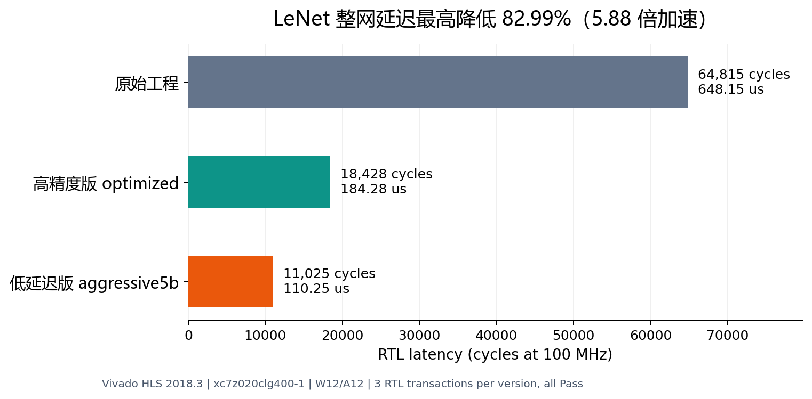

# LeNet 延迟优化与功耗估算报告

日期：2026-09-13。源码来自指定的 FPGA_LeNet_final.zip；原始文件的完整性见 [original_integrity.json](results/original_integrity.json)。工具为本机 Vivado/Vivado HLS 2018.3，器件 xc7z020clg400-1，时钟 10ns，W12/A12，33位整数累加。

## 1. 主要结果

按"latency优先、允许accuracy下降"的要求交付两个版本，二者验证流程完全相同（同一 C testbench、同样的前3张 MNIST 输入做 C/RTL 联合仿真，再跑全量10000张 CSim）：

| 交付版本 | RTL cycles | 单图时间(100MHz) | 相对原始基线 | 10000张CSim准确率 |
|---|---:|---:|---:|---:|
| 高精度版 `optimized` | 18,428 | 184.28μs | 下降71.57%，加速3.52倍 | **98.94%**（9894/10000） |
| 低延迟版 `aggressive5b` | 11,025 | 110.25μs | 下降82.99%，加速5.88倍 | **96.55%**（9655/10000） |

原始基线为 64,815 cycles（648.15μs，RTL实测）。时间由验证的周期数乘目标时钟计算，是 RTL 仿真结果，不是板卡计时。重视准确率选高精度版，重视延迟选低延迟版。

高精度版的100000个最终raw logits与包内Python Fixed参考全部一致，没有用牺牲准确率换取加速。低延迟版在此基础上做卷积通道剪枝（Conv1 6→5、Conv2 16→12）并提高FC1并行度，准确率 96.55%，通道选择经全量离线消融确定（见第3节）。原Float参考准确率98.97%是ZIP历史值，不是本次重新跑Float的结果。

## 2. 综合与RTL结果分开比较

| 版本 | HLS min / max cycles | RTL cycles | DSP | BRAM_18K | LUT | FF | 说明 |
|---|---:|---:|---:|---:|---:|---:|---|
| baseline | 30 / 474826 | 64815 | 146 | 14 | 17279 | 33932 | 原源码 |
| straight | 64809 / 64809 | 未运行 | 146 | 14 | 16776 | 33919 | 顺序调用原算子 |
| noflatten | 64551 / 64551 | 未运行 | 146 | 13 | 16697 | 33896 | straight删flatten复制 |
| optimized | 18428 / 18428 | 18428 | 201 | 25 | 16411 | 35306 | 高精度版（最终优化） |
| fc24b | 15798 / 15798 | 15798 | 217 | 25 | 16856 | 37613 | optimized+FC1 24路并行 |
| aggressive12b | 13936 / 13936 | 未运行 | 217 | 17 | 13522 | 37451 | fc24b+Conv2裁到12通道 |
| aggressive5b | 11025 / 11025 | 11025 | 217 | 9 | 13729 | 38694 | 低延迟版（再裁Conv1到5通道） |

`baseline`为原源码；`straight`只替换手写状态循环，保留原算子与复制；`noflatten`在straight上只删恒等复制；`optimized`为高精度最终优化；`fc24b`、`aggressive12b`、`aggressive5b`是后续压缩延迟的阶梯，通道剪枝细节见第3节。

原始474826不能当作真实每张图的运行周期。原while-switch含14次迭代，HLS将最长分支按14次组合成保守上界（33916×14+2=474826），没有利用每个状态实际只执行一次的信息。仅改顺序调用就能让报告上界变小，但RTL基线证实真实推理约6.48万周期。所以本报告用RTL实测64815、18428和11025计算收益，没有用474826做加速比例的分母。

### 为什么旧的定点化没有明显降低latency

量化减少位宽和部分算术逻辑，但没有增加存储端口。原卷积展开8个空间位置并行读取，有限的输入存储端口使综合器将目标II=1改成实际II=4。原Pool也受到4次读取的端口限制。乘法器/LUT数量下降不意味着循环迭代间隔缩短；整网还串行执行各层和多次整块复制。

### 本次真正减少周期的改动

1. 输入和Pool1划为8个显式存储块，每周期从每块只读一次。随后通过小型选择逻辑恢复8个相邻位置，避免2018.3对动态下标的保守判断。仅加cyclic partition的失败实验保存在experiments/cyclic_v1。
2. Conv2改为8个空间位置×16输出通道，16个权重块独立读取。两层卷积的MAC循环都达到II=1。总DSP201，未超过器件220个的容量。
3. 用输出行/列循环生成卷积地址；简化原空间位置转换。Conv1 HLS为33913→7849 cycles，Conv2为14777→2553 cycles。
4. 依据max(ReLU(x))=ReLU(max(x))融合ReLU/Pool，保留卷积输出的原量化时机；两个融合Pool均II=1。
5. FC1直接读连续CHW的Pool2存储，删除flatten复制和独立buffer。FC三层继续使用原权重、舍入与饱和规则。
6. 低延迟版追加：FC1并行输出从8提到24；Conv2输出通道从16裁到12、Conv1输出通道从6裁到5（被裁通道的特征与下游权重一同删除）；DSP用满到217/220。

## 3. 低延迟版的通道剪枝与精度权衡

剪枝不重新训练，直接删除通道及其下游权重，因此准确率会下降；目标是在 DSP 上限内用可接受的精度换延迟。通道选择没有采用单一启发式排序直接拍板，而是做了10000张全量的定点离线评估（[eval_prune_variants.py](eval_prune_variants.py)，该模型与C仿真在前3张样本上逐位一致，结果存于 [channel_ablation.json](results/channel_ablation.json)）：

Conv1删1个通道的全部6种可能（Conv2保留集已定为下表最优者）：删0：77.11%；删1：92.00%；删2：93.44%；删3：96.55%；删4：94.53%；删5：86.35%。**最终删除通道3**。

Conv2保留12个通道的排序方法对比（Conv1已按上面结果剪枝）：

| 排序依据 | 10000张准确率 |
|---|---:|
| fc1_weight_l1 (final) | 96.55% |
| conv2_weight_l1 | 94.99% |
| activation_mean_abs | 71.13% |
| activation_nonzero | 79.67% |

按FC1权重L1范数排序最优，保留通道 {10,0,3,2,12,8,13,6,14,1,9,5}。

需要说明：中途曾按Conv1权重L1排序删除通道2，实测只有93.44%；穷举6种删除方案后改删通道3，**同样的硬件、同样 11,025 cycles 下准确率从93.44%提升到96.55%**。粗粒度排序指标不足以决定通道取舍，最终以穷举结果为准。两种选择只改 testbench 的权重收集表，综合电路与延迟不变。

低延迟版证据链：3张 C/RTL cosim Pass（11,025 cycles，与HLS综合一致）；3张CSim logits 与 numpy 定点模型逐位相同；10000张 CSim 准确率 96.55% 与离线消融模型完全一致。

中间点供参考：`aggressive12b`（6×12通道）离线准确率 97.22%，HLS综合 13936 cycles，未做全量CSim，未列入交付。

## 4. Flatten 可消除的条件与单独收益

Pool2是[16][4][4]，地址i=16c+4h+w；原Flatten及FC1读取次序都是同一个i。直接连接无需移动数据、转置、重新训练或重排权重。优化后的Pool2生产端仍写回连续CHW；较早层使用的银行布局不改变这个约定。低延迟版通道数变少后地址公式变为12c+4h+w，映射关系同样成立。

消融实验：64809→64551 cycles，单独省 **258 cycles（2.58μs，0.398%）** 和 **1 BRAM_18K**。5张HLS CSim的50个raw logits完全一致。flatten是可以删掉的小开销，卷积访存才是主要瓶颈。[地址与参考验证](results/layout_check.json)包含10组参考的2560个数和两层共24000个输入地址检查。

## 5. 功耗指标

HLS C Simulation没有直接的FPGA功耗W输出。本次以相同C测试输入驱动RTL仿真，XSim采集SAIF，再导入Vivado布局布线后的电路运行report_power。以下是 **仿真活动驱动的核心功耗估算**，不是CPU运行C代码的功耗，也不是板上功耗实测。

| 版本 | 总片上功耗 W | 动态 W | 器件静态 W | 工具置信度 | 总能量 μJ/图 | 动态能量 μJ/图 |
|---|---:|---:|---:|---|---:|---:|
| baseline | 0.177 | 0.073 | 0.104 | High | 114.723 | 47.315 |
| optimized | 0.164 | 0.060 | 0.104 | High | 30.222 | 11.057 |

SAIF直接匹配的设计网络比例：baseline：54%   (25824/47540)；optimized：69%   (30149/43416)。其余网络由Vivado概率传播估算，工具的High置信度不表示100%实测覆盖。

外部输入的越界X已通过存储模型处理；HLS RTL内部仍有空闲时不关心的总线X（Power 33-288告警），限制了活动估算精度。功耗用于同条件方案比较，更精确的功耗需门级时序仿真或板上测量。

能量=报告功耗×RTL推理时间；功耗报告精度为0.001W，能量是基于该舍入值的近似，分项独立舍入可能不严格相加等于总数。SAIF来自前3张MNIST，包含testbench复位和短事务间隔，不能代表所有输入分布。动态功耗只覆盖加速器核心，不包含外部权重存储、PS工作负载、DDR和板上电源损耗；器件静态功耗沿用Vivado的全器件估算。环境温度25℃、100MHz、典型工艺，其余电压/散热采用报告默认值（包括250LFM airflow），没有板级校准。单张图更快不必然意味着瞬时W更低，因此同时列出每次推理能量。

功耗仿真的外部存储模型对越界的无效预读保持上一个有效数据，避免原HLS检查模型把空闲总线变成X而影响估算。修改仅位于`power_memory_models`，DUT RTL不变；重放后的每组30个raw logits均与对应C期望值匹配。实际集成时应让外部存储的使能/地址范围符合该约定。

OOC使用理想化模块边界，缺少真实系统的clock入口和port落点。布局布线报告可用于核心功耗估算，不能作为整板时序签核；各组均存在输入边界hold违例，须在实际系统接线后重新约束。实际板级时钟与存储等待时间可能改变端到端耗时。

低延迟版 aggressive5b 可按同一流程补测功耗（`capture_activity.py aggressive5b` + `power_impl.tcl aggressive5b`，脚本已支持该变体）；本报告交付时其 SAIF 采集尚未完成——该版本输入改为784个全分区寄存器，XSim 在 `--debug all` 下枚举 SAIF 对象耗时显著长于前两版。其功耗预期与高精度版同量级：DSP 数量相近（217 vs 201），动态能量则随周期数同比下降。

## 6. 原始证据与复现

- [基线RTL报告](build/baseline/solution1/sim/report/lenet_accelerator_with_weights_cosim.rpt)、[高精度版RTL报告](build/optimized/solution1/sim/report/lenet_accelerator_with_weights_cosim.rpt)、[低延迟版RTL报告](build/aggressive5b/solution1/sim/report/lenet_accelerator_with_weights_cosim.rpt)
- [高精度版HLS综合报告](build/optimized/solution1/syn/report/lenet_accelerator_with_weights_csynth.rpt)、[低延迟版HLS综合报告](build/aggressive5b/solution1/syn/report/lenet_accelerator_with_weights_csynth.rpt)、[全部综合CSV](results/synthesis.csv)
- [高精度版全量CSim](results/optimized/csim_10000.csv)、[低延迟版全量CSim](results/aggressive5b/csim_10000.csv)、[通道消融数据](results/channel_ablation.json)、[汇总与源码哈希](results/summary.json)
- [baseline功耗报告](results/baseline/power/activity_power.rpt)、[optimized功耗报告](results/optimized/power/activity_power.rpt)
- [运行方式与接口说明](README.md)、[最终顶层](lenet_fast.cpp)、[优化算子](fast_kernels.h)
- 低延迟版首轮通道选择（删通道2，93.44%）的全量CSim留档在 experiments/csim_10000_aggressive5b_drop2.csv，用于对比通道选择的影响。

官方方法依据：[UG902 2018.3](https://docs.amd.com/v/u/2018.3-English/ug902-vivado-high-level-synthesis)、[UG907 功耗分析](https://docs.amd.com/api/khub/documents/Gf3ajG3H3eT7C1YKAuUjYg/content)。
